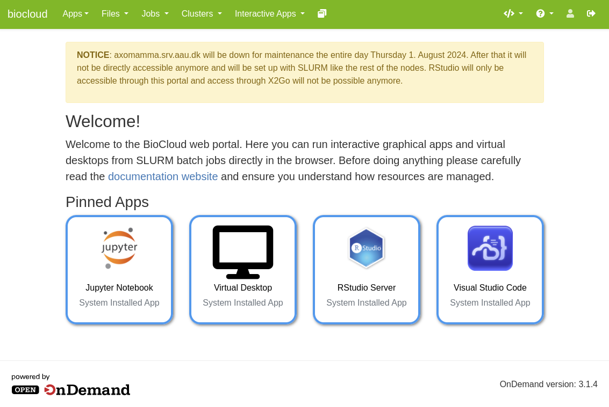

# Interactive Web portal (OpenOndemand)
Another way to access the BioCloud compute resources is to use the interactive web portal based on [Open Ondemand](https://openondemand.org/) developed by [Ohio Supercomputer Center](https://www.osc.edu/). The main purpose of the web portal is to greatly simplify running interactive and graphical apps such as virtual desktops and IDEs, which are served directly from isolated SLURM jobs running on the compute nodes, but you can also easily browse around and transfer files, obtain a shell, check the job queue, or compose job batch scripts based on templates, and more - all from your browser without having to learn a multitude of terminal commands.

This page only describes briefly how to connect to the web portal. Guides detailing how to use all of its features are available under the [Guides section](../guides/webportal/files.md). It is also **absolutely essential** to read and understand how SLURM and resource management works (described on the [next page]()), before using any of the apps, because interactive apps are often terribly inefficient (i.e. CPUs do nothing when you are just typing or clicking around)!

## Getting access
In order to access the web portal you must first be connected to the local AAU campus network, or [through VPN](ssh.md#vpn). Then go to [https://biocloud.bio.aau.dk](https://biocloud.bio.aau.dk) and log in using your usual AAU credentials if you aren't already (for example if you've already signed in to your AAU webmail, etc). For security reasons the website is **NOT** exposed to the public internet, hence your browser will likely warn you that the site is insecure because the [SSL certificate](https://www.cloudflare.com/learning/ssl/what-is-an-ssl-certificate/) can't be validated by an authority because it can't access it:

But don't worry, traffic is still encrypted. To solve this, depending on your browser, just click **Advanced** and then **proceed to biocloud.bio.aau.dk (unsafe)**:

If this is the first time you ever log in to any of the BioCloud resources, your home directory does not yet exist on the [network storage](../storage.md) and you will likely see an error. To create your home directory you must log in just once either [through SSH](ssh.md) as described on the previous page or using the web portal shell, which is available [here](https://biocloud.bio.aau.dk/pun/sys/shell). You can also just contact an admin. Now you should be greeted by the front page:

Now, please read through the SLURM guide on the following pages before using any of the apps. Afterwards you can go through the guides for the individual apps under the [Guides section](../guides/webportal/files.md).