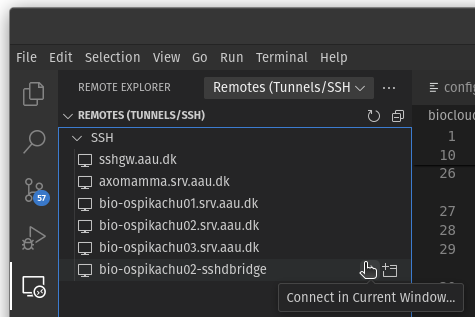

# Interactive VS Code session in a SLURM job
When using the [Visual Studio Code IDE](https://code.visualstudio.com/) to work remotely, you would normally install the [Remote - SSH](https://code.visualstudio.com/docs/remote/ssh) on your local computer and connect to the particular machine over an SSH connection to work there instead. This is useful when you for example need to work closer to raw data to avoid moving large data around, or when you simply need more juice for demanding tasks. In order to use VS Code remotely on a SLURM cluster, however, you can't normally connect directly to a compute node, and connecting directly to login nodes to run things there is **strictly forbidden**. This small guide will show you how you can connect your VS Code session directly to a SLURM job running on a compute node instead.

???+ Important
      Please note that this should be considered an [interactive job](../slurm/request.md#interactive-jobs) and the SLURM job should therefore be submitted to a partition that has [over-provisioning](../slurm/request/#overprovisioning) set up, where CPU's are shared, because you will likely spend time typing instead of actually keeping the allocated CPU's busy at all times, which is a waste of resources.

## How does it work?
When you normally connect to a remote server, you use an SSH client to connect to the SSH daemon `sshd`, which is a service running in the background on the server. You then simply talk to this daemon using the SSH protocol to execute commands on the server. The trick here is then to start a separate `sshd` process that runs within a SLURM job, which you then connect to instead through a bridge connection to the job through one of the login nodes.

## SLURM job script
[Log in through SSH](../../access/#access-through-ssh) on one of the login nodes, copy the following SLURM batch script somewhere, and [adjust the resource requirements](../slurm/request/#non-interactive-jobs) for your session. Submit the job using `sbatch` as usual, and remember to [cancel](../slurm/jobcontrol/#cancel-a-job) it when you are done. It won't stop when you close the VS Code window on your computer unless it runs out of time. You will have to submit a job like this every time you want to use VS Code interactively (for anything else than code editing and file browsing etc). 

```
#!/bin/bash
#SBATCH --output=/dev/null
#SBATCH --job-name=sshdbridge
#SBATCH --time=0-3:00:00
#SBATCH --partition=default-op
#SBATCH --cpus-per-task=4
#SBATCH --mem=6G

# exit on first error or unset variable
set -eu

# find open port (open and close a socket, and reuse the port)
PORT=$(python3 -c 'import socket; s=socket.socket(); s.bind(("", 0)); print(s.getsockname()[1]); s.close()')
scontrol update JobId="$SLURM_JOB_ID" Comment="$PORT"

# check whether SSH host key exists (used for sshd host authentication, NOT for user authentication)
ssh_host_key="ssh_host_ed25519_key"
if [[ ! -s "${HOME}/.ssh/${ssh_host_key}" ]]
then
  mkdir -p "${HOME}/.ssh/"
  ssh-keygen -t ed25519 -N "" -f "${HOME}/.ssh/${ssh_host_key}"
  chmod 600 "${HOME}/.ssh/${ssh_host_key}"
fi

# start sshd server on the available port
echo "Starting sshd on port $PORT"
/usr/sbin/sshd -D -p "${PORT}" -f /dev/null -h "${HOME}/.ssh/ssh_host_ed25519_key"
```

## Adjust local SSH config
On your local computer, you need to set up a bridge connection through a login node by adding a few lines to your [SSH config file](../../access/#ssh-config-file). You will only have to do this once. You can find it through VS Code under the "Remote Explorer" side menu by clicking the little cog "Open SSH Config File":


Then add the following line somewhere:

```
Host bio-ospikachu02-sshdbridge
    ProxyCommand ssh bio-ospikachu02.srv.aau.dk "nc \$(squeue --me --name=sshdbridge --states=R -h -O NodeList,Comment)"
```

In this example, the hostname of the login node `bio-ospikachu02.srv.aau.dk` must already exist in your SSH config file for it to work. You can use the provided [SSH config template](../../access/#ssh-config-file-template) if you haven't added any BioCloud hosts there yet, and you can also use any other login node. Save the file and you should now see the new bridge host under "Remote Explorer" (you may need to hit refresh first):



Finally, click the "Connect in New (or current) Window" icon next to the name. If all goes well you should see the name of the login node (as it's named in your SSH config) in the bottom left corner:


Now you can start working! Whatever you do in VS Code now will run remotely inside a SLURM job on one of the compute nodes with a connection through the login node. Magic.

## Notes
 - You will not be able to connect if you use an [SSH jump host](../../access/#using-an-ssh-jump-host). [Connect through VPN](../../access/#vpn) instead if you are not at AAU.
 - You can connect to the same job simultaneously as many times as you want, however if you have separate resource requiements, you must submit individual jobs and use a different name for each job, and also create separate entries in the SSH config for each job.
