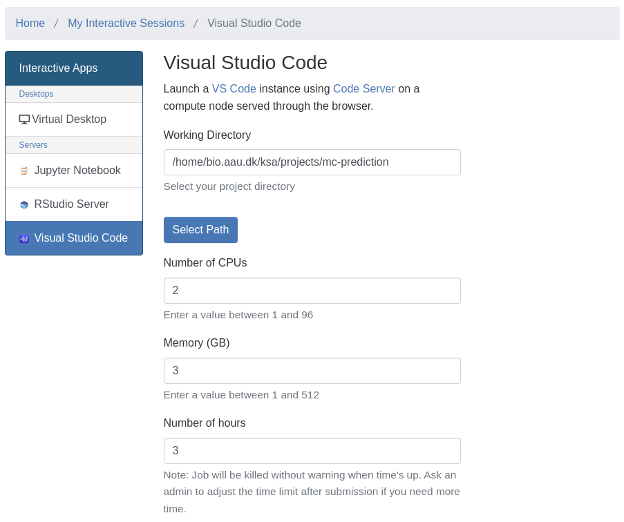
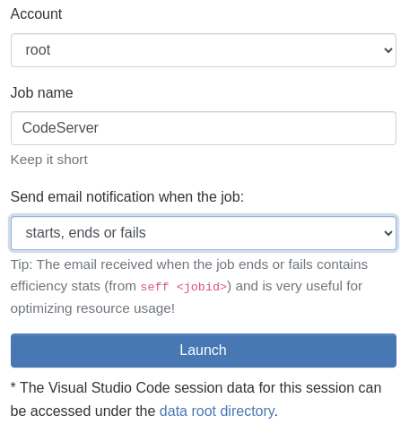
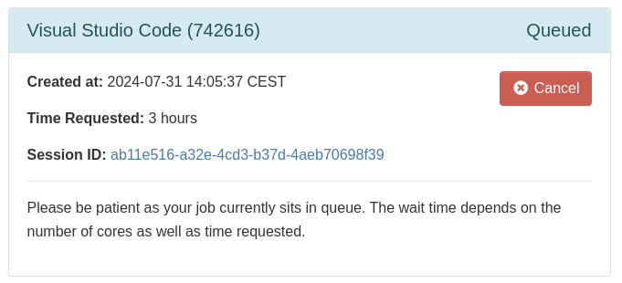

# Code server
[Code Server](https://github.com/coder/code-server) is an open source alternative to [Visual Studio Code](https://code.visualstudio.com/) provided by [Coder](https://coder.com/), which can be run through a web browser. It's based on much of the same code base and has the exact same features overall, however there are minor differences. If you want the full VS Code experience you must follow [this guide](../../sshdslurm.md) instead. This app will allow you to run a Code Server in a SLURM job and access it directly from your browser.

## Starting the app
Start by selecting the desired working directory where Code will start (you can also change this inside), and the amount of resources that you expect to use and for how long:

Now it's important to choose an appropriate [hardware partition](../../../slurm/partitions.md) for your job. You almost always want to use the `default` partition where CPUs are shared, however if you are sure that you will keep them busy for most of the duration by [optimizing CPU efficiency](../../../slurm/efficiency.md), or if you need a lot of memory, you can go ahead and use other partitions. Otherwise, please just use the `default` partition. If you need to use a specific node, for example if you need some fast and [local scratch space](../../../storage.md#local-scratch-space), you can type the hostname in the **Nodelist** field, otherwise just leave it blank. Keep in mind that selecting individual compute nodes may result in additional queue time.

Lastly, you can give the job an appropriate name and choose when you would like to receive an email. Most users don't need to choose between different accounts, since your user will likely only belong to a single one, in which case just leave it as-is. Then click Launch!

## Accessing the app
When you've clicked **Launch** SLURM will immediately start finding a compute node with the requested amount of resources available, and you will see a **Queued** status. When the chosen hardware partition is not fully allocated this usually only takes a few seconds, however if it takes longer, you can check the job status and the reason why it's pending under the [Jobs](../jobqueue.md) menu, or by using [shell commands](../../../slurm/jobcontrol.md#get-job-status-info).

When the job has been granted a resource allocation the server needs a little while to start and you will see the status change to **Starting**

and when it finishes a button will appear to launch Code Server:

You can now start working:

## Stopping the app
When you are done with your work, it's important to stop the app to free up resources for other users. You can do that by clicking the red **Cancel** button under **My Interactive Sessions**, see the screenshots above.

!!! warning "Always inspect and optimize efficiency for next time!"
    When the job completes, **!!!ALWAYS!!!** inspect the CPU and memory usage of the job in either the notification email received or using [these commands](../../../slurm/accounting.md#job-efficiency-summary) and adjust the next job accordingly! This is essential to avoid wasting resources which other people could have used.
