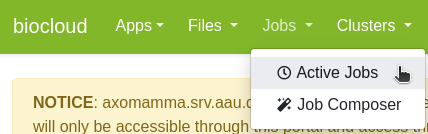

# Job queue
You can browse the SLURM job queue and see details of all queued and running jobs by clicking **Jobs** and then **Active jobs**:

By default you will only see your own jobs, so it might be empty at first. To see the entire queue and the running jobs from all users click **Your Jobs** at the top right and then select **All Jobs**:

You can now see a list of **all** queued and running jobs as well as recently completed jobs for each [hardware partition](../../slurm/partitions.md) (confusingly named **Queue**):

To see additional details of individual jobs click the little arrow to the left of each job:

