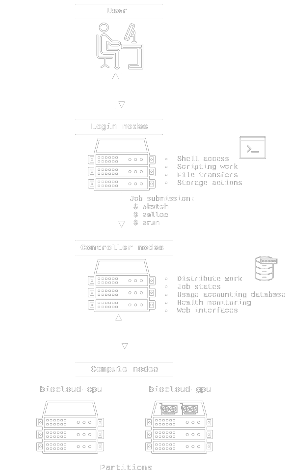

# Introduction to SLURM
SLURM (Simple Linux Utility for Resource Management) is a highly flexible and powerful job scheduler for managing and scheduling computational workloads on high-performance computing (HPC) clusters. SLURM is designed to efficiently allocate resources and manage job execution on clusters of any size, from a single server to tens of thousands. SLURM manages resources on an HPC cluster by dividing compute nodes into partitions. Users submit jobs to these partitions from a login-node, and then the SLURM controller schedules and allocates resources to those jobs based on available resources and user-defined constraints. SLURM also stores detailed usage information of all users' jobs in a usage accounting database, which allows enforcement of fair-share policies and priorities for job scheduling for each partition.

The BioCloud compute nodes are divided into separate partitions depending on their hardware, see the [hardware overview](../index.md) for an up to date list. They currently share the same usage policy groups (currently no limit first-in-first-out).

## BioCloud SLURM cluster overview


## Getting started
Start with obtaining shell access to either of the 3 login nodes `bio-ospikachu[01-03].srv.aau.dk` as described in [Getting access](../access.md). To start with it's always nice to get an overview of the cluster, it's partitions, and how many ressources that are currently allocated. This is achieved with the `sinfo` command, example output:

```
$ sinfo
PARTITION AVAIL  TIMELIMIT  NODES  STATE NODELIST
general*     up 14-00:00:0      3    mix bio-oscloud[02-04]
general*     up 14-00:00:0      2   idle bio-oscloud[05-06]
high-mem     up 28-00:00:0      1  boot^ bio-oscloud07
high-mem     up 28-00:00:0      1  alloc bio-oscloud08
gpu          up 14-00:00:0      1    mix bio-oscloud09
```

To get an overview of running jobs use `squeue`, example output:
```
# everything
$ squeue
 JOBID         NAME       USER       TIME    TIME_LEFT CPU MIN_ME ST PARTITION NODELIST(REASON)
  2380         dRep user01@bio 9-00:31:24   4-23:28:36  80   300G  R   general bio-oscloud02
  2389        dramv user02@bio 8-16:14:07   5-07:45:53  16   300G  R   general bio-oscloud02
  3352       METAGE user03@cs. 1-13:00:45     10:59:15  10   125G  R   general bio-oscloud03
  3359      ar-gtdb user02@bio 1-00:04:32   5-23:55:28  32   300G  R   general bio-oscloud03
  3361     bac_gtdb user02@bio 1-00:03:05   5-23:56:55  32   500G  R   general bio-oscloud04
  3366  interactive user04@bio    2:03:42   2-00:56:18  60   128G  R   general bio-oscloud02
  3426       blastn user05@bio      41:56   3-23:18:04  96   200G  R   general bio-oscloud03
  3430  interactive user06@bio       7:23      3:52:37   1     2G  R   general bio-oscloud02
  3333 as-predictio user07@bio 2-19:42:49   6-04:17:11   5    16G  R       gpu bio-oscloud09
  3372      checkm2 user02@bio   21:37:50   6-02:22:10 192  1800G  R  high-mem bio-oscloud08

# specific user (usually yourself)
$ squeue -u $(whoami)
 JOBID         NAME       USER       TIME    TIME_LEFT CPU MIN_ME ST PARTITION NODELIST(REASON)
  3333 as-predictio user07@bio 2-19:42:49   6-04:17:11   5    16G  R       gpu bio-oscloud09
```

Or get a more detailed overview per compute node of current ressource allocations and which jobs are running etc with the wrapper script from [slurm_tools](https://github.com/OleHolmNielsen/Slurm_tools) `pestat`:
```
$ pestat
Hostname            Partition     Node Num_CPU  CPUload  Memsize  Freemem  Joblist
                                 State Use/Tot  (15min)     (MB)     (MB)  JobID User ...
bio-oscloud02        general*     mix  157 192   78.53*   957078   714399  2380 user01@bio.aau.dk 2389 user02@bio.aau.dk 3366 user04@bio.aau.dk 3430 user06@bio.aau.dk  
bio-oscloud03        general*     mix  138 192   99.74*   957078   737701  3352 user03@cs.aau.dk 3359 user02@bio.aau.dk 3426 user05@bio.aau.dk  
bio-oscloud04        general*     mix   32 192    3.86*   957078   712866  3361 user02@bio.aau.dk  
bio-oscloud05        general*    idle    0 192    0.00    957078  1000920   
bio-oscloud06        general*    idle    0 192    0.07    957078   968067   
bio-oscloud07        high-mem    idle    0 240    0.00   1914660  2011251   
bio-oscloud08        high-mem   alloc  192 192  126.01*  1914680  1843547  3372 user02@bio.aau.dk  
bio-oscloud09             gpu     mix    5  64    2.36*   214195   206950  3333 user07@bio.aau.dk  
```

See `pestat -h` for more options.

## Live monitoring
For live monitoring of the whole cluster, the ressource utilization of individual nodes, number of SLURM jobs running etc, visit the [Grafana dashboard](http://bio-ospikachu04.srv.aau.dk:3000/) (only available on the internal AAU network).
